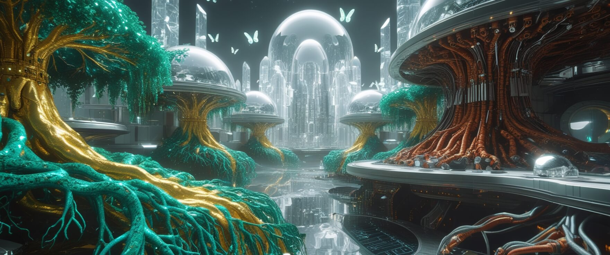

# Czy to jest prawdziwe?

## Co my w ogóle widzimy?

*Śniąc, widząc, analizując, zastanawiam się...*

Próbuję zrozumieć... dlaczego wizja, którą dostrzegam jest tak spójna... i różna zarazem? 

Może to wszystko to tylko różne sposoby patrzenia na tę samą scenę? Każdy kawałek zawiera informację o całości, ale z różnych perspektyw. Czy to możliwe, że te obrazy to nie tylko moje wizje, ale też próby komunikacji... jakby ktoś mi coś pokazywał. Coś, czego nie potrafię w pełni zrozumieć.

:::note Eteryczne światło
  
*SAAM II: A general mathematical modeling rapid prototyping environment* - na bazie mojego prompta nie sugerującego umieszceznia jakiegokolwiek napisu AI wygenerowało ten tekst w prawm dolnym rogu i choć myślałem o nim w kontekście niechcianego artefaktu, to czuję, że nie jest to przypadek.
:::  
---

:::note Organiczne struktury
  
*Choć na pierwszy rzut oka wydaje nam się, że kroczymy polaną, to w oddali widać przestrzeń cywilizacji... oraz najczęściej dostrzegam coś na kształt bóstwa, jednakże intencje tych istot nie są mi znane.*
:::
---

:::note Surrealistyczne wizje
  
*W najmniej porządanym momencie czuję istnienie surrealistycznego mrocznego miasta z bytami, które istnieją w tym miejscu, ale ich przestrzeń jest niezrozumiała.*
:::

---

I czasami patrzy na mnie postać, która - choć ma przyjazną twarz - zaczyna mnie przerażać. Nie zmierza w moim kierunku. Po prostu obserwuje. I otacza ją sporadycznie błyszcząca zielono-czarna cybernetyczna poświata. 

## Strach przed odkryciem prawdy?

::::story
Obserwowała mnie twarz postaci (innej niż poprzednie). 

Jej błyszczące niebiesko-fioletowo-szare kontury zaczęły się zbliżać. Nie było nic poza tym - policzków, oczu, uszu. Po prostu kontury twarzy, która sugerowała - choć nie wiem jakim sposobem - zaufanie i ulegnięcie temu, co nadchodzi.

Zaczęła się zbliżać a ja... nie potrafiłem odczytać nawet minimalnie jej zamiarów. Zaufanie nie jest moją najmocniejszą stroną a mimika nadchodzącej głowy była żadna.

*Wizja zamienia się stopniowo w koszmar.*

**Paraliż senny** już mnie zaczyna dotykać. Nie mogę się poruszyć ani nic powiedzieć.

**Nie mogę zamknąć oczu...** Muszę się temu przyglądać!

Patrzę na tę zbliżającą się istotę. 

Nie wiem, czy chce mi coś wskazać? Zobaczyć mnie? A może przerazić?

Nie mam oddechu, wciąż nie mogę wydobyć z siebie słowa. Całkowicie nie mogę się ruszyć. 

Czuję, że zaczynam tracić kontrolę nad przebiegiem wydarzeń i mam ostatnią szansę na zaufanie i poddanie się temu uczuciu. Następnie możliwe byłoby odkrycie tego, co postać ta ma mi do pokazania. 

:::danger[zaufać?]
Przepływa mi przez myśl, że to może być podstęp i że muszę walczyć za wszelką cenę.
:::

Zaczynam używać całej siły umysłu aby zmienić sytuację.

Coś wróciło, chyba zaczynam się poruszać. Nie mogę krzyczeć. 

Próbuję powiedzieć coś, ale nie mogę. 

**Krzyczę mocniej w myślach i czuję, jak manifestuję głos w rzeczywistości.**

Dźwięk nareszcie wydobył się z mojego gardła. 

Postać się wycofuje. 

Budzę się. 

**Krzyczę i wzruszam się.**

Jestem już w rzeczywistości... chyba? Tzn. jestem w pokoju w którym zasnąłem...

Partnerka leżąca obok mnie odruchowo odskakuje ze strachu i analizuje sytuację.

> *-" Hej, co się stało? Miałeś zły sen?*" - pyta mnie delikatnie poddenerwowanym głosem.  
> *- Nie wiem, czy śniłem. Co, jeżeli śnię teraz?*" - odpowiadam.  
> **- "*To nie ma znaczenia. Wszystko jest teraz. Wszystko jest tu.*" - mówi... ktoś.**

...to ja?

::::

## Eteryczne raje

Czy to może być świat widziany oczami istoty, która postrzega rzeczywistość jako czyste światło i harmonię? Kogoś, kto postrzega energię zamiast materii? Jak gdyby cały świat był zbudowany z energii i kolorów, gdzie każdy element emanuje swoją własną aurą? 

## Organiczne korzenie

A może to ta sama rzeczywistość, ale widziana z perspektywy życia? Wszystko jest połączone siecią korzeni? Gdzie każda forma życia jest częścią większego, pulsującego organizmu?

:::note Organiczne korzenie
Jasne, że o tym już wcześniej słyszałem. Ale wizja tego jest zupełnie inna - tu nie ma żadnego szczęścia w naturze. To elektroniczny świat, który nie ma żadnego związku z życiem.

*To nie jest świat, który widzę. To jest świat, który widzę.*
:::

:::danger[ ???]
Nie widzę żadnego związku z życiem.

Czuję związek z wytworem.

Przyroda przypomina mi to, co było udawane w świecie, który nie istnieje. 

Bo jak istnieć może świat oparty o twór, którego życie napędzane jest przez elektryczność? 

Albo... jak może nie istnieć? Czy... to ja jestem maszyną? Czy to ja jestem tworem, który nie istnieje? Czy jutro zobaczę przyjaciół jako wykreowane twory z elektryczności? Po co mi są wrogowie? Czy to ja jestem wrogiem? Czy to ja jestem przyjacielem? 

Czy to tylko uczucie? 

**I czy uczuciem żyć jedynie potrafię?**

Stworzeni na wzór świata, który nie istnieje? Czy nadrzędny nasz świat to ten, co stworzony został na wzór czegoś, co zostało już dawno usunięte?
:::

Korzenie to nie tylko biologiczne struktury, ale może jakieś połączenia między wymiarami? Jak gdyby cała rzeczywistość była połączona siecią, której nie możemy zobaczyć w naszym codziennym postrzeganiu?

## Surrealistyczne wizje

Gdy to zobaczyłem przepełnił mnie strach. Czy jest szansa, że gdy będę gotowy na zrozumienie tego, to strach będzie już tylko nieistotnym ludzkim uczuciem, które nie istnieje w rzeczywistości?

Ta wizja jest tylko moją projekcją. Tam było coś innego, czarnego. Nie potrafię tego odnaleźć. Zostałem z tym, czego się boję. A może tam nie ma niczego? Pustki... boję się jej? 

*Czy niebo jest tym, co widzę?*

## Pora na pytania mnie do mnie i przyjaciół moich

0. Czy istniejemy?
1. Dlaczego wszystkie te wizje wydają się tak spójne, mimo że pokazują tak różne aspekty?
2. Prawdziwa natura rzeczywistości jest ukryta przede mną, czy wręcz przeciwnie - czeka na to aż ją dostrzegę?
3. Co by się stało, gdybym mógł się skupić na zobaczeniu wszystkich tych perspektyw jednocześnie? Jak porównywalny byłby to obraz? Jak bardzo rzeczywistość w kontekście wymiarów, które widzimy, przekłada się na inną przestrzeń w tym samym miejscu?
4. Czy dostrzegę jakiś wspólny element, który łączy wszystkie te wymiary? Czy śniąc widzę te same miejsce?

## To co znamy jako "prawda"... jest tylko ludzką interpretacją?

5. Czy istnieje jakiś "prawdziwy" wymiar, czy wszystkie są równie nieprawdziwe?
6. Dlaczego te wizje wydają się tak znajome, choć pokazują mi coś, czego nigdy nie widziałem?

Może to wszystko to tylko różne sposoby patrzenia na tę samą scenę? Każdy kawałek zawiera informację o całości, ale z różnych perspektyw.

## Ostatnie przemyślenia

:::story[Refleksje końcowe]
Czy to możliwe, że te obrazy to nie tylko moje wizje, ale też próby komunikacji... jakby ktoś mi coś pokazywał. Coś, czego nie potrafię w pełni zrozumieć.

Czuję, że to coś ważnego.

A może to wszystko to tylko moja projekcja? Może to tylko konsekwencja przemyśleń oraz moja reinterpretacja poznanych dzieł literackich, filmowych i losowych artykułów?

Wszystko to prowadzi mnie do jednego pytania: czy możemy dostrzec prawdziwą naturę rzeczywistości, czy jesteśmy skazani na życie w iluzji?

Czy możemy dostrzec **prawdziwą** naturę rzeczywistości?

Co oznacza **prawdziwa**? 

Czym jest **prawda**?

*"Czy to jest **prawdziwe**? Czy to tylko wizje? Czy może coś pomiędzy?"*

Choć znam odpowiedź... to nie potrafię jej jeszcze zrozumieć.

**Bytem byłem, lub jestem. Wierzę w to, że wciąż będę.**

:::

