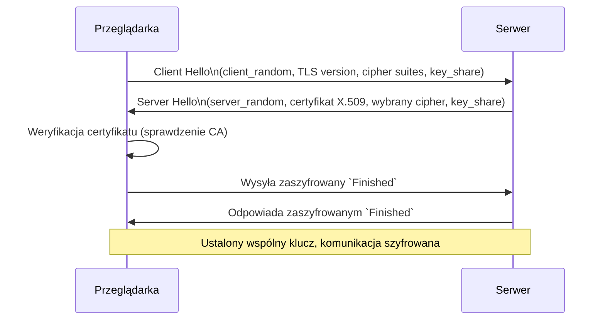

# Jak działa SSL/TLS z punktu widzenia aplikacji lub przeglądarki – dla programisty

## 🔐 Cel SSL/TLS

SSL/TLS zapewnia:
- **Poufność** – dane są szyfrowane, więc osoba trzecia nie może ich odczytać  
- **Integralność** – wiadomość nie została zmieniona w drodze  
- **Uwierzytelnienie** – przeglądarka może sprawdzić, że łączy się z właściwym serwerem

---

## 🔄 Proces nawiązywania połączenia TLS (Handshake)

### 1. **Client Hello**  
Przeglądarka (lub aplikacja) inicjuje połączenie:

Wysyła:
- `client_random` – losowy ciąg bajtów, używany później przy generowaniu kluczy  
- Wersję TLS (np. 1.3)  
- Listę obsługiwanych **cipher suites** – zestawów algorytmów do szyfrowania  
- Rozszerzenia, np. **SNI (Server Name Indication)** – ujawnia nazwę domeny, do której chce się połączyć  
- Opcjonalnie: `key_share` – fragment klucza do wymiany klucza szyfrującego (ECDHE)

### 2. **Server Hello**  
Serwer odpowiada:

- `server_random` – kolejny losowy ciąg bajtów, używany przy generowaniu kluczy  
- Wybiera jedną z cipher suites  
- Wysyła **certyfikat X.509** – zawiera m.in. nazwę domeny, datę ważności, klucz publiczny  
- Wysyła swój `key_share` (jeśli TLS 1.3) – do wspólnego obliczenia tajnego klucza  
- Potwierdza nazwę domeny z SNI

> **Certyfikat X.509** – standardowy format certyfikatu, który zawiera dane właściciela, klucz publiczny oraz podpis wystawcy

### 3. **Weryfikacja certyfikatu**  
Przeglądarka:
- Sprawdza, czy certyfikat jest ważny (daty, domena, podpis)  
- Sprawdza łańcuch certyfikatów do **zaufanego CA (Certificate Authority)** – np. Let's Encrypt, DigiCert  
- Opcjonalnie sprawdza, czy certyfikat nie został odwołany (CRL, OCSP)

> **CA (Certificate Authority)** – zaufany urząd, który wystawia certyfikaty po weryfikacji właściciela

### 4. **Ustalenie klucza sesji**

Na podstawie:
- `client_random`  
- `server_random`  
- `shared secret` – wspólnie uzyskany wynik z algorytmu ECDHE (Elliptic-curve Diffie–Hellman)  
....
. przeglądarka i serwer generują:
- `master secret` → z niego wyprowadzają klucze szyfrujące i uwierzytelniające

> **key_share** – publiczna część klucza ECDHE, wykorzystywana do wygenerowania `shared secret` bez przesyłania go jawnie

> **shared secret** – wspólny sekret, znany tylko przeglądarce i serwerowi, mimo że przesyłane dane nie są tajne (bezpieczne dzięki ECDHE)

### 5. **Finished & szyfrowana komunikacja**  
- Obie strony przesyłają zaszyfrowane wiadomości `Finished`, aby potwierdzić, że handshake zakończył się sukcesem  
- Od tego momentu cała komunikacja jest szyfrowana

---

## 🧠 Diagram poglądowy

---

## 📌 Kluczowe pojęcia

| Termin            | Znaczenie                                                                 |
|-------------------|--------------------------------------------------------------------------|
| `client_random`   | Losowy ciąg bajtów od klienta, używany przy generowaniu kluczy           |
| `server_random`   | Losowy ciąg bajtów od serwera, używany razem z client_random             |
| `key_share`       | Fragment publicznego klucza do uzgadniania tajnego `shared secret`       |
| `shared secret`   | Sekret wyliczony na bazie `key_share`, znany tylko przeglądarce i serwerowi |
| Certyfikat X.509  | Standardowy certyfikat zawierający tożsamość, klucz publiczny i podpis   |
| CA                | Zaufany urząd certyfikujący – np. Let's Encrypt, który potwierdza tożsamość |
| TLS 1.3           | Najnowsza wersja protokołu – uproszczona, bezpieczniejsza niż starsze    |
